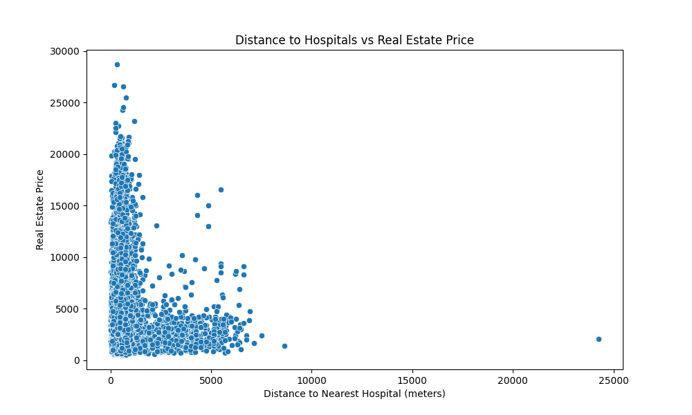
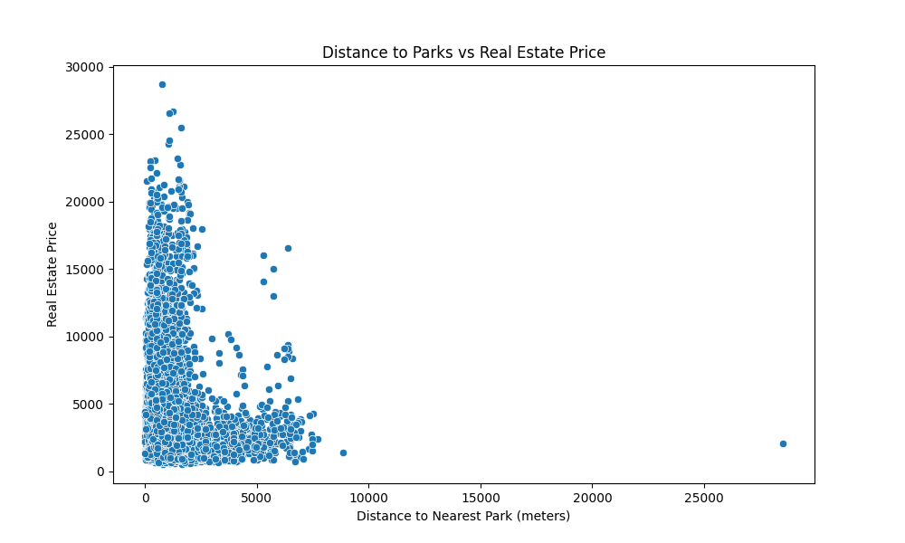
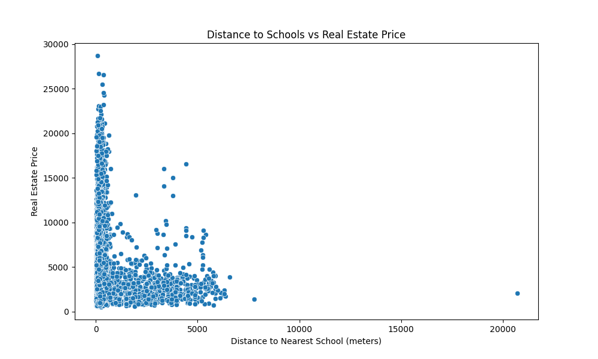
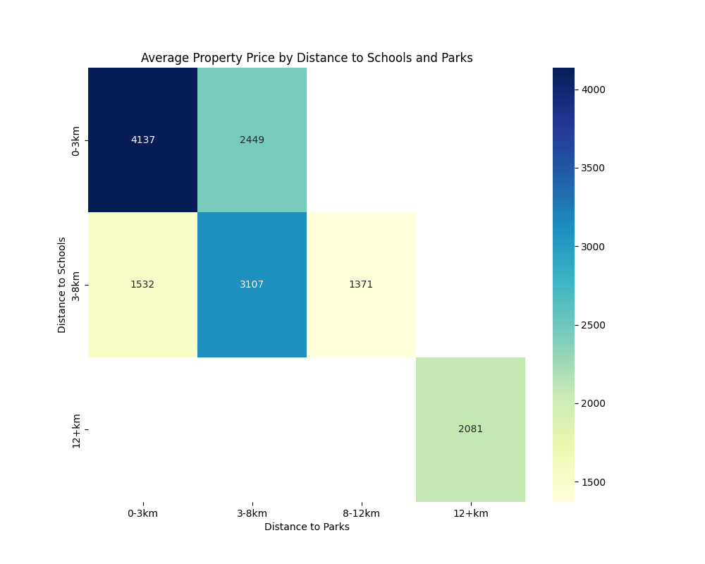

# Análise de Habitação e Serviços em São Paulo

## Índice
1. [Introdução](#introdução)
2. [Preparação dos Dados](#preparação-dos-dados)
3. [Análise e Visualização](#análise-e-visualização)
4. [Principais Resultados](#principais-resultados)
5. [Conclusão](#conclusão)

---

### Introdução
Este projeto explora a relação entre preços de aluguel de imóveis e a proximidade de serviços essenciais em São Paulo, como escolas, hospitais e parques. O principal objetivo é determinar se estar próximo desses serviços afeta os preços de aluguel e visualizar possíveis padrões resultantes.

---

### Preparação dos Dados
O projeto utiliza várias fontes de dados, incluindo informações geográficas sobre serviços e moradia em São Paulo. Aqui está uma visão geral das etapas de preparação:

- **Fontes de Dados**: 
  - Diversos arquivos `.shp` contêm dados espaciais sobre serviços, agrupados em categorias como **educação**, **saúde**, **cultura**, **esportes** e **limites da cidade**.
  - Conjuntos de dados principais sobre propriedades de aluguel incluem informações como latitude, longitude e preço de aluguel.

- **Scripts**: Os seguintes scripts foram desenvolvidos para processar e filtrar os dados:
  - **`pre_process_geoapify.py` e `pre_process_geopy.py`**: Lidam com enriquecimento inicial de dados e mapeamento de coordenadas usando APIs Geoapify e Geopy.
  - **`filter_data.py`**: Filtra os dados das propriedades para incluir apenas informações relevantes dentro dos limites de São Paulo.

- **Dados Finais Preparados**: Após a filtragem, os dados incluem preços de aluguel, localização dos imóveis e distâncias calculadas para as escolas, hospitais e parques mais próximos.

---

### Análise e Visualização Detalhada

O projeto examinou como a proximidade a serviços essenciais influencia o preço dos aluguéis em São Paulo. A análise utilizou cálculos estatísticos, normalizações e visualizações para explorar padrões e entender a relação entre proximidade a serviços e os preços dos imóveis.

#### Exploração Inicial dos Dados

- **Distribuição dos Aluguéis**: A análise inicial mostrou que os preços de aluguel variam amplamente em São Paulo, com uma concentração maior em faixas intermediárias, mas com outliers notáveis. Essa variação pode refletir diferenças nas características dos imóveis ou na atratividade dos bairros.
- **Correlação entre Aluguel e Distância a Serviços**:
  - A proximidade a **escolas** apresentou uma correlação fraca com os preços de aluguel, com um valor de -0,06. Isso sugere uma tendência muito leve de que imóveis próximos a escolas tenham preços ligeiramente mais altos.
  - Para **hospitais**, a correlação foi ainda mais baixa, -0,05, e para **parques**, o valor foi de -0,09. Essas correlações negativas, embora presentes, são fracas e indicam que a proximidade a esses serviços não exerce uma influência significativa sobre os aluguéis. Isso pode sugerir que locatários em São Paulo priorizam outros fatores ao escolher um imóvel.

#### Cálculo e Interpretação do Coeficiente Composto

Para capturar o efeito combinado da proximidade a serviços nos preços de aluguel, foi calculado um **coeficiente composto de proximidade-aluguel**. Esse coeficiente é uma média ponderada das distâncias normalizadas a escolas, hospitais e parques, padronizando-as para uma escala comum. Com um valor final de **0,06**, o coeficiente reforça que a influência agregada desses serviços é praticamente insignificante no preço do aluguel.

#### Visualizações Geradas

As visualizações detalham a relação entre proximidade a serviços e aluguel, proporcionando uma análise visual que complementa os achados estatísticos.

1. **Gráficos de Dispersão (Distância vs. Aluguel)**:
   - Os gráficos de dispersão mostram a relação entre os preços de aluguel e a distância a escolas, hospitais e parques, permitindo verificar se há alguma tendência clara. Estes gráficos estão salvos como:
     - 
     - 
     - 
   - Observa-se uma leve tendência nos gráficos, onde, em média, imóveis mais próximos a serviços apresentam aluguéis um pouco mais altos. No entanto, a dispersão dos pontos reforça que essa tendência é fraca. Há muitos imóveis distantes de serviços com aluguéis altos, o que indica que a proximidade não é um fator determinante.

2. **Mapas de Calor (Heatmaps)**:
   - **Mapa de Calor Combinado dos Serviços**: Este mapa de calor agrega os três serviços principais em um único mapa, mostrando áreas de São Paulo com alta densidade de serviços. Ele permite observar se essas áreas de concentração coincidem com locais de aluguel elevado.
     - 
   - **Mapa de Calor para Escolas e Parques**: Neste mapa de calor, são destacados especificamente escolas e parques, ajudando a identificar zonas de conveniência com múltiplos serviços. Visualmente, observa-se que essas áreas nem sempre coincidem com os locais de aluguel mais alto.
     - 

3. **Mapa Interativo**:
   - O mapa interativo permite uma análise espacial dos dados de aluguel e da proximidade aos serviços. Nele, o usuário pode ativar e desativar camadas para visualizar onde os serviços estão concentrados e observar como os preços de aluguel variam em diferentes regiões:
     - **Distribuição dos Serviços e Imóveis**: O mapa interativo permite alternar entre camadas para visualizar escolas, hospitais e parques. Isso ajuda a identificar onde esses serviços se encontram e qual é sua relação com a localização dos imóveis.
     - **Mapa de Calor de Aluguel**: Este mapa de calor mostra as áreas de São Paulo com os aluguéis mais altos, permitindo verificar se há sobreposição com áreas de alta densidade de serviços. As regiões de aluguel elevado não coincidem necessariamente com as áreas de maior concentração de serviços, sugerindo que outros fatores estão em jogo.
   - [Mapa Interativo de Proximidade e Aluguel](outputs/sao_paulo_property_services_distance_map_with_alpha_legend.html)

Essas visualizações, combinadas com a análise estatística, reforçam a conclusão de que a proximidade a serviços essenciais não é um fator predominante na determinação dos preços de aluguel em São Paulo. Isso sugere que fatores específicos dos imóveis ou características do bairro provavelmente exercem uma influência mais significativa.

---

### Principais Resultados

#### 1. Análise de Correlação
   - **Correlação Fraca**: A análise revelou uma relação mínima entre o aluguel e a distância para serviços individuais:
     - Escolas: -0,06
     - Hospitais: -0,05
     - Parques: -0,09
   - Essas correlações negativas sugerem que, em média, imóveis mais próximos desses serviços podem ter preços de aluguel ligeiramente mais altos. No entanto, a fraqueza da correlação indica que a proximidade a esses serviços não é um fator significativo na determinação dos preços de aluguel. Outros fatores, como características específicas do imóvel ou localização em bairros desejados, podem ter mais influência.

#### 2. Coeficiente Composto Proximidade-Aluguel
   - Um coeficiente composto proximidade-aluguel foi calculado para capturar o efeito combinado da proximidade com os três tipos de serviços sobre os preços de aluguel. Com um valor final de **0,08**, esse coeficiente confirma que a influência da proximidade com esses serviços sobre o preço do aluguel é mínima, sugerindo que esses serviços têm pouca relevância prática na definição dos preços.

#### 3. Análise Espacial com Mapas de Calor
   - **Mapas de Calor** revelam a concentração espacial dos serviços em certas regiões de São Paulo. Embora certas áreas exibam uma alta densidade de serviços, não há uma relação visível e significativa entre essas concentrações e os preços de aluguel, o que reforça a conclusão de que a proximidade a serviços não é um fator primário para o custo dos aluguéis.
   - **Distribuição de Aluguéis**: A visualização dos preços em áreas com diferentes densidades de serviços permite observar que altos preços de aluguel estão espalhados em diversas regiões, independentemente da concentração de serviços.

#### 4. Outliers e Observações Adicionais
   - **Outliers Identificados**: Durante a análise, foram identificados imóveis com aluguéis elevados, mesmo quando situados longe dos serviços analisados. Isso indica que o preço do aluguel é potencialmente mais influenciado pelas características do imóvel, como área útil e número de quartos, ou pelo apelo específico de certos bairros.

---

### Conclusão

Esta análise conclui que a proximidade de escolas, hospitais e parques tem um efeito insignificante nos preços de aluguel em São Paulo. Abaixo estão as principais conclusões detalhadas e recomendações para análises futuras:

1. **Impacto Mínimo da Proximidade aos Serviços**: Os resultados mostram coeficientes de correlação fracos para a proximidade de serviços, e o coeficiente composto de proximidade-aluguel de 0,08 indica que esses serviços específicos (escolas, hospitais, e parques) não exercem uma influência significativa nos preços de aluguel. Esse resultado sugere que a proximidade a esses serviços não é um fator essencial na definição dos preços de aluguel para a maioria dos locatários.

2. **Fatores Alternativos Potencialmente Mais Relevantes**:
   A análise indica que fatores além da proximidade aos serviços, como características do bairro e atributos do imóvel, provavelmente desempenham um papel mais importante na determinação do valor do aluguel.
   - **Características do Bairro**: Variáveis como segurança, qualidade do transporte público, e renda média da vizinhança podem ter uma influência maior nos preços dos aluguéis. Bairros com boa infraestrutura e conveniências adicionais tendem a ser mais valorizados.
   - **Especificações do Imóvel**: O tamanho do imóvel, número de quartos, vagas de garagem e estado de conservação do edifício são fatores conhecidos por afetar significativamente o valor do aluguel. É recomendável que estudos futuros incorporem essas variáveis para uma análise mais abrangente.

3. **Recomendações para Análises Futuras**:
   - **Incorporar Análise Multivariada**: Recomenda-se o uso de modelos de regressão multivariada para investigar como diferentes fatores (além da proximidade a serviços) influenciam os preços de aluguel. Isso permitiria controlar as variáveis ao mesmo tempo e identificar quais fatores têm o maior impacto.
   - **Explorar Outros Serviços e Infraestruturas**: Para entender melhor os interesses dos locatários, análises futuras poderiam incluir outras amenidades, como a proximidade de shoppings, transporte público, academias, e áreas de lazer, além de indicadores de qualidade de vida no bairro.
Este estudo fornece insights sobre a insignificância relativa desses serviços na determinação do aluguel, com recomendações para futuras análises que considerem fatores mais amplos ou alternativos.
   - **Mapeamento Interativo para Padrões Espaciais**: O uso de mapas interativos que incluam camadas adicionais, como índices de criminalidade e de acesso a transporte, poderia facilitar uma análise mais rica e personalizada dos padrões de aluguel em São Paulo.

Este estudo fornece uma base para futuras análises de habitação na cidade de São Paulo, sugerindo que, para compreender o mercado de aluguel, é essencial considerar uma gama mais ampla de fatores além da proximidade a escolas, hospitais e parques.

---

### Apêndices e Referências
- **Scripts**: Veja `scripts/` para detalhes sobre o processamento de dados e análise.
- **Saídas**: Visualizações e mapas interativos estão em `outputs/`.
- **Dados**: Dados geográficos originais e conjuntos de dados de aluguel estão localizados no diretório `data/`.

--- 

Este relatório resume as descobertas da Análise de Habitação e Serviços em São Paulo. Para mais detalhes, consulte o código-fonte e as visualizações incluídas no repositório.
